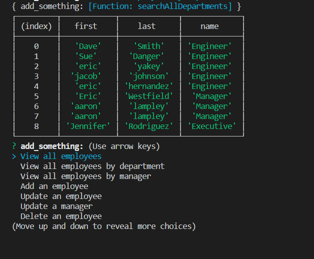

## weather application 
> Employee Tracker!

## Table of contents
* [General info](#general-info)
* [Screenshots](#screenshots)
* [Setup](#setup)
* [Status](#status)
* [Contact](#contact)

## General info
This is a command line application that allows a user to manage and add to an employee database using SQL and inquirer.
## Screenshots



## Setup
This program runs in the console. SQL and inqurirer is needed to run this application.

## Code Examples

 ```function searchAllDepartments() {
    connection.query(
        "SELECT employees.first, employees.last, department.name FROM employees LEFT JOIN department  ON employees.role_id = department.id;", 
        (err, res) => {
            if (err) {
                throw err
            } else {
                console.table(res)
                start();
            }
        }
    )
}
```


    This is a function that sorts all the employees by their department.


## Status
Project is in progress. Feel free to email me with any suggestions or to report any bugs: ianmharris93@gmail.com


## Contact
Created by Ian Harris(https://github.com/iannm93) - ianmharris93@gmail.com - feel free to contact me!
